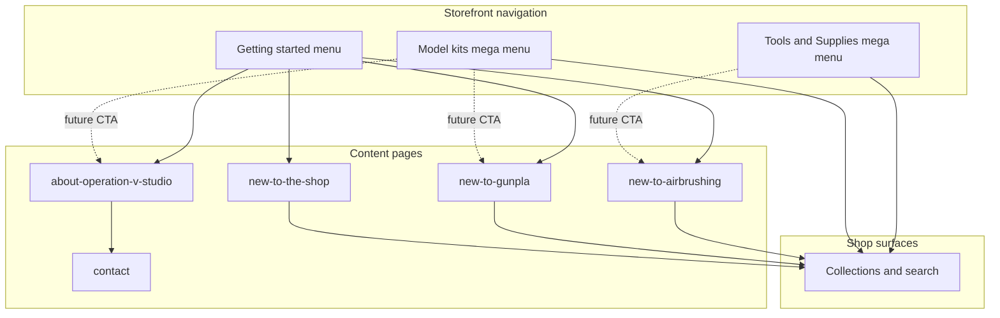

# Storefront content hierarchy — Operation V Studio

**Status:** Approved direction · **mega menus stay shop-first until pages exist**  
**Last updated:** 2026-08-25  
**Shop:** operationvstudio.com · **Theme:** `ovs-shopify-theme` (dev POC: Rise – AI Dev `#196218716241`)  
**Related:** [shopify-nav-taxonomy-plan.md](./shopify-nav-taxonomy-plan.md) · [static-content-pages-workflow-and-about-us.md](../shopify-theme/static-content-pages-workflow-and-about-us.md) · [tools-supplies-classification.md](./tools-supplies-classification.md)

---

## 1. Principles

| Rule | Why |
| --- | --- |
| **Nav mega menus = shopping paths** | Grade, series, franchise, tool shelf — not tutorials |
| **Content pages = orientation** | Grades explained, first kit ideas, shipping, studio story |
| **CTA tiles hand off to pages** | Black “Start here” card: 1 headline + ≤2 buttons → `/pages/…`, not inline essays |
| **One job per page** | Avoid a single “everything for newcomers” page |
| **Curated links on every guide page** | Each guide ends with links to **collections** or **pre-filtered URLs** (see [tools-supplies-classification.md §7](./tools-supplies-classification.md#7-pre-filtered-url-pattern-for-nav--getting-started)) |
| **Draft theme + page safety** | New Pages use internal handles until go-live — see [`ovs-shopify-theme/docs/process/SHOPIFY-PAGE-DRAFT-SAFETY.md`](../../ovs-shopify-theme/docs/process/SHOPIFY-PAGE-DRAFT-SAFETY.md) |

**Interim (now):** Model kits mega menu POC keeps **shop columns + placeholder Start here card** (collection/search CTAs). Do **not** wire content-page CTAs until the target page exists and is reviewed.

### Beginner kits (Operation V definition)

**All model kits with selling price under $35 CAD are “beginner kits”** for storefront copy, guides, and curated links — **not** tied to Entry Grade or any single Bandai line.

| | Notes |
| --- | --- |
| **Rule** | ERP `main_type = model kit` and catalog **selling price** `< 35.00` CAD (`product_selling_prices.selling_price`) |
| **Not** | Entry Grade only, age/kids positioning, or grade-based defaults |
| **Storefront target** | `/collections/beginner-kits` (live — model kits **≤ $35** CAD; ~190 SKUs) |
| **Guide page** | `new-to-gunpla` explains grades separately; “beginner kits” shelf = **affordable entry points** under $35 |
| **Mega menu (future)** | “Beginner kits” CTA → beginner collection, **not** `/collections/entry-grade-eg` |

**ERP snapshot (2026-08-25):** ~386 model kit SKUs priced under $35; ~120 published on Shopify with `available_qty > 0` (vs ~228 total in-stock model kits).


## 2. Information architecture (target)

```text
Top nav (target)
├── Model kits ▾          → shop columns (+ optional CTA tile → content pages)
├── Tools & Supplies ▾    → shelf links (+ optional CTA tile later)
├── Miscellaneous
└── Getting started ▾     → content hub (no products in dropdown)
```



**Audience split**

| Visitor question | Page | Not in |
| --- | --- | --- |
| “How does this shop work?” (shipping, ordering, pickup) | **New to the shop** | Model kits mega menu body copy |
| “I've never built Gunpla / model kits” | **New to Gunpla** | Mega menu columns |
| “I want to airbrush” | **New to airbrushing** | Model kits card |
| “Who are you / can I build in store?” | **About Operation V Studio** | — |
| “I know what I want” | Collections / mega menu columns | Content pages |

---

## 3. Content page registry

Stable handles (Shopify Page). Use **`page.<handle>.json`** templates where possible.

| Handle | URL | Page title (customer) | Purpose | Status | Theme template |
| --- | --- | --- | --- | --- | --- |
| `about-operation-v-studio` | `/pages/about-operation-v-studio` | About Operation V Studio | Studio story, Montréal visit, community | **Draft template** (`page.about-us-2.json` on dev theme); Admin page TBD | `page.about-us-2` → rename to `page.about-operation-v-studio` when stabilized |
| `contact` | `/pages/contact` | Contact | Hours, form, directions fallback | **Theme template exists** | `page.contact` |
| `new-to-the-shop` | `/pages/new-to-the-shop` | New to Operation V Studio | Ordering, shipping, pickup, account basics | **Not created** | TBD (`page.new-to-the-shop`) |
| `new-to-gunpla` | `/pages/new-to-gunpla` | New to Gunpla? | Grades (HG-first for adults), tools you need, curated kit links — **not** “Entry Grade for everyone” | **Not created** (404); linked from About draft | TBD |
| `new-to-airbrushing` | `/pages/new-to-airbrushing` | New to airbrushing? | First purchases, link to airbrush + paints shelves | **Not created** | TBD |
| `shipping-and-returns` | `/pages/shipping-and-returns` | Shipping & returns | Policy detail (optional split from new-to-the-shop) | **Not created** | TBD |
| `events` | `/pages/events` | Events & demos | Studio events, product demos (optional, later) | **Not created** | TBD |

**Policy pages (Shopify Admin, low design priority):** Privacy (live), Terms, Refund — footer only; not part of Getting started dropdown.

---

## 4. Page outlines (content task — not mega menu copy)

### 4.1 New to the shop (`new-to-the-shop`)

- Welcome to Operation V (online + Montréal)
- How ordering works · shipping across Canada · pickup if offered
- Where to go next → links: **New to Gunpla**, **Tools & Supplies**, **About**
- CTA: Browse collections (until `/collections/model-kits` exists, use flagship collections or search)

### 4.2 New to Gunpla (`new-to-gunpla`)

- What Gunpla is · what's in the box · snap-fit basics
- **Grades in plain language** (EG = simplified/kids-leaning; **HG = common adult start**; RG/MG when ready) — grades ≠ “beginner” at OVS
- **Beginner kits at OVS:** under **$35** — link to beginner collection when it exists; mix of HG, SD, EG, 30MM, etc.
- **Tools:** nippers first → link `/collections/nippers-and-knives` or starter subset
- **Curated picks:** optional featured SKUs from the under-$35 set — manual or ERP-maintained
- Studio angle: “Visit us — we’ll help you pick” → About / Contact
- Cross-link: **New to airbrushing** (optional, footer of page)

### 4.3 New to airbrushing (`new-to-airbrushing`)

- When airbrush vs hand paint · starter checklist
- Links: `/collections/airbrush`, `/collections/paints`, thinners/cleaners on T&S hub
- Cross-link: **New to Gunpla** (build first, paint second)

### 4.4 About Operation V Studio (`about-operation-v-studio`)

- Story, studio, build space (existing draft sections in `page.about-us-2.json`)
- Visit block: address, map, Contact
- CTAs (already drafted in JSON): Browse kits · Directions · **New to Gunpla** · Contact

---

## 5. Where content is discovered (placement matrix)

| Surface | Role | Links to |
| --- | --- | --- |
| **Homepage hero / banner** (first visit, later) | “New here?” | `new-to-the-shop` or `new-to-gunpla` |
| **Getting started ▾** (top nav, future) | Primary content hub | All guide pages + About |
| **Model kits mega menu — Start here card** (future) | Shop nav escape hatch | Max 2: `new-to-gunpla`, `about-operation-v-studio` |
| **Tools & Supplies mega menu — promo slot** (future, optional) | Hand off to airbrush guide | `new-to-airbrushing` |
| **About page** | Studio + bridge to guides | `new-to-gunpla`, collections |
| **Footer** | Persistent | About · Contact · guides · policies |
| **Announcement bar** | Rare promos | Events, shipping promo — not guides |

**Do not duplicate:** First-time **shop** welcome belongs on homepage or **Getting started**, not inside the Model kits dropdown header.

---

## 6. Mega menu CTA slots (current vs future)

Dev theme file: `ovs-shopify-theme/snippets/ovs-model-kits-mega-menu-poc.liquid`

### 6.1 Model kits — `Start here` card (column 1)

| | Now (interim) | Future (after pages live) |
| --- | --- | --- |
| **Eyebrow** | Start here | Start here |
| **Headline** | Find your next build | Not sure where to start? |
| **Body** | Short shop-oriented line (optional; keep ≤1 sentence) | Optional one-liner only |
| **Primary CTA** | Shop Gunpla (search) | **New to Gunpla?** → `/pages/new-to-gunpla` |
| **Secondary CTA** | Beginner kits → `/collections/beginner-kits` | **About the studio** → `/pages/about-operation-v-studio` |
| **Shop link from guide** | — | `new-to-gunpla` page links **Beginner kits** → under-$35 collection (§1) |
| **Remove / avoid** | — | Entry Grade as **definition** of beginner · Shop Gunpla on card once guide exists · View all (no collection) · Long copy |

Shop columns (2–5) unchanged: grades, series, 30 Minutes Label, other franchises.

### 6.2 Tools & Supplies mega menu

No content CTA tile yet. When added, prefer **one** link: **New to airbrushing?** → `/pages/new-to-airbrushing`. Shelves remain the main dropdown body.

### 6.3 Getting started top-level menu (future)

| Menu label | URL |
| --- | --- |
| New to Operation V Studio | `/pages/new-to-the-shop` |
| New to Gunpla? | `/pages/new-to-gunpla` |
| New to airbrushing? | `/pages/new-to-airbrushing` |
| About the studio | `/pages/about-operation-v-studio` |
| Contact | `/pages/contact` |

Track in `.cursor/task-tracker.json` as `storefront_getting_started_nav` (see [phase-9-nav-cutover.md](../shopify-integration/phase-9-nav-cutover.md)).

---

## 7. Collection & search targets for guide pages

Until smart collection **`model-kits`** exists, guides should link to **named shelves** already used in the mega menu:

| Intent | Link target |
| --- | --- |
| Gunpla browse | Search `?q=Gunpla&type=product` or grade collections (`/collections/high-grade-hg`, etc.) |
| **Beginner kits (OVS: ≤ $35)** | `/collections/beginner-kits` |
| First kit — grade context | `/collections/high-grade-hg` + copy on `new-to-gunpla` (HG as common adult start, not “beginner” by price) |
| First kit — kids / simplified | `/collections/entry-grade-eg` — optional mention only |
| Starter tools | `/collections/nippers-and-knives`, `/collections/tools-and-supplies` |
| 30 Minutes | Search `30MM 1/144` / mega menu sublinks |
| Pokémon | `/collections/pokemon` |

### 7.1 Mega menu shelves — all on `/collections/…` (2026-08-26)

**Pattern:** ERP `mk:*` tags → Shopify smart collections → mega menu URLs. Full registry: **[model-kit-storefront-shelves.md](./model-kit-storefront-shelves.md)**.

| Mega menu label | Collection handle |
| --- | --- |
| Shop Gunpla | `gunpla` |
| Beginner kits | `beginner-kits` *(price rule, not mk:)* |
| Entry Grade | `entry-grade-eg` |
| SD Gundam (+ all SD subs) | `sd-gundam`, `sd-ex-standard`, `sd-cross-silhouette`, … |
| High Grade (+ HG subs) | `high-grade-hg`, `hg-universal-century`, `hg-gundam-seed`, … |
| Real Grade | `real-grade-rg` |
| Master Grade (+ MG subs) | `master-grade-mg`, `mg-standard`, `mg-ver-ka`, `mgex`, `master-grade-sd-mgsd` |
| Perfect Grade | `perfect-grade-pg` |
| Gundam series block | `gundam-universal-century`, `gundam-seed`, `gundam-wing`, … |
| 30 Minutes Label | `30-minutes-missions`, `30-minutes-armored-core`, … |
| Pokémon / Kotobukiya / Moderoid | `pokemon`, `kotobukiya`, `moderoid` |

**Do not** use search URLs or `tag:'mk:…'` in nav. Provision shelves: `php artisan products:model-kit-shelf-collections`.

**Still needs Shopify Admin collection rules (not theme-only):** `entry-grade-eg` includes option parts; long-term fix = per-series smart collections synced from ERP `series` + `accessory_kind`.

When **`/collections/model-kits`** is created (ERP `main_type = model kit` smart collection), update: About CTAs, guide “browse all”, and retire `/collections/all` for kit-specific copy.

---

## 8. Implementation phases

| Phase | Work | Mega menu |
| --- | --- | --- |
| **A — Now** | Document hierarchy (this file); mega menu POC = **shop paths only**; placeholder Start here card | No new page CTAs |
| **B — Pages** | Create stub Pages + JSON templates; About go-live on draft theme; `new-to-gunpla` MVP copy | Still shop CTAs on card |
| **C — Wire CTAs** | Swap Start here buttons to content pages; add Getting started nav | 2 page links on card |
| **D — Homepage** | First-visit welcome → `new-to-the-shop` | — |
| **E — Collections** | `model-kits` smart collection; **`beginner-kits`** (price `< $35` + model kit); fix About “Browse model kits” URL | “Browse all model kits” / “Beginner kits” CTAs use real collections |

---

## 9. Explicitly out of scope (here)

- ERP taxonomy / tag push ([shopify-nav-taxonomy-plan.md](./shopify-nav-taxonomy-plan.md))
- Tools & Supplies filter manifest / e2e ([storefront-ts-collection-filters](../../ovs-shopify-theme/docs/storefront-ts-collection-filters.manifest.json))
- Publishing live theme `#190542250065`
- Auto-creating Shopify Pages from CI (human approval per [SHOPIFY-PAGE-DRAFT-SAFETY.md](../../ovs-shopify-theme/docs/process/SHOPIFY-PAGE-DRAFT-SAFETY.md))

---

## 10. Open decisions

1. Rename `page.about-us-2.json` → `page.about-operation-v-studio.json` when Admin page handle is finalized.
2. Single **welcome** entry point: homepage → `new-to-the-shop` vs `new-to-gunpla` (recommend **shop** first, Gunpla second).
3. Whether **Getting started** is top-level nav or footer-only until content is ready.
4. Curated “first kits” on `new-to-gunpla`: manual list vs ERP-maintained flag.
5. French copy / bilingual pages (future).

---

## References

- Mega menu POC: `ovs-shopify-theme/snippets/ovs-model-kits-mega-menu-poc.liquid`
- About draft JSON: `ovs-shopify-theme/templates/page.about-us-2.json`
- Nav cutover task: `docs/shopify-integration/phase-9-nav-cutover.md`
- Page draft safety: `ovs-shopify-theme/docs/process/SHOPIFY-PAGE-DRAFT-SAFETY.md`
